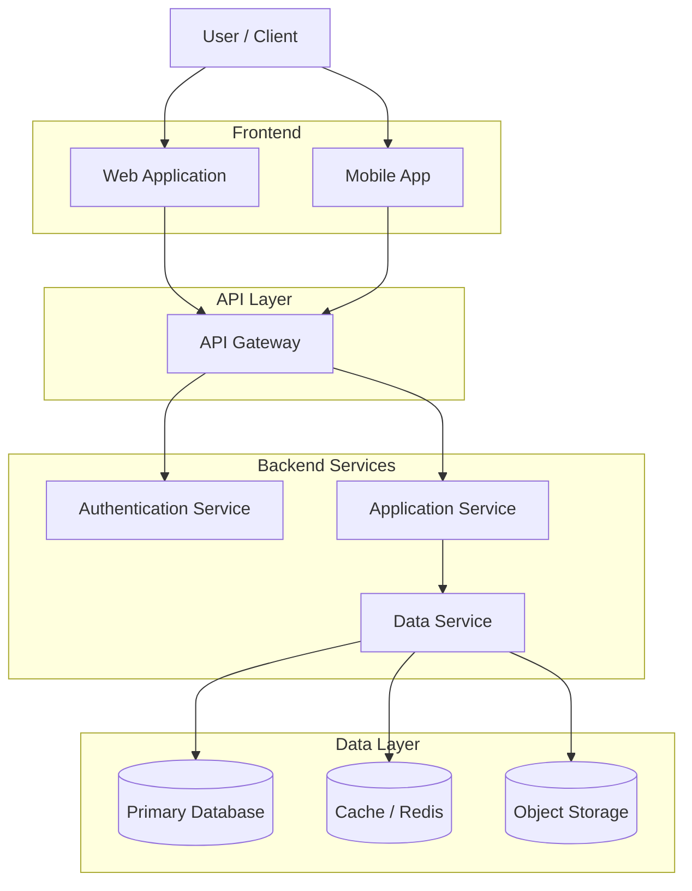

# Architecture Diagram

## Overview

Dieses Dokument beschreibt das grundlegende Architekturdiagramm der Anwendung.
Es zeigt die wichtigsten Komponenten und deren Beziehungen.

## High-Level Architecture

## Component Description

### Client Layer

* **Web Application** – Browserbasierter Zugriff auf das System
* **Mobile App** – Optionaler mobiler Zugang

### API Layer

* **API Gateway**

  * zentraler Einstiegspunkt
  * Routing zu Backend-Services
  * Rate Limiting / Logging

### Backend Services

* **Authentication Service**
  Verwaltung von Login, Tokens und Benutzerrechten

* **Application Service**
  Enthält die zentrale Business-Logik

* **Data Service**
  Abstraktionsschicht für Datenzugriffe

### Data Layer

* **Primary Database** – Persistente Daten
* **Cache** – Performance-Optimierung
* **Object Storage** – Dateien, Uploads, Assets

## Goals

* klare Trennung der Schichten
* skalierbare Services
* einfache Erweiterbarkeit
