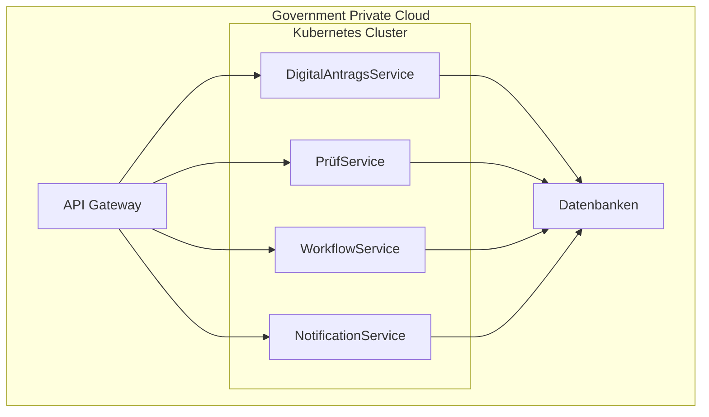

# Deployment Architecture

Dieses Dokument beschreibt die technische Bereitstellung der Plattform.

---

# Infrastrukturmodell

Die Plattform wird in einer hybriden Infrastruktur betrieben.

Komponenten:

- Government Private Cloud
- On-Premises Infrastruktur
- Containerplattform

---

# Infrastrukturkomponenten

## Containerplattform

Technologie:

- Docker
- Kubernetes

Verantwortlich für:

- Skalierung der Microservices
- Service-Orchestrierung
- Load Balancing

---

## API Gateway

Zentrale Schnittstelle für alle Anwendungen.

Funktionen:

- Routing
- Authentifizierung
- Rate Limiting
- Monitoring

---

## Identity System

Zentrale Authentifizierung.

Funktionen:

- Single Sign-On
- Multi-Faktor-Authentifizierung
- Rollenverwaltung

---

## Datenbanken

Mehrere spezialisierte Datenbanken:

Transaktionsdaten  
PostgreSQL

Dokumentenarchiv  
Dokumentenspeicher

Reporting  
Data Warehouse

---

# Deployment Diagram

Dieses Deployment Diagram zeigt die Architektur des Systems in einer Government Private Cloud Umgebung mit Kubernetes.

---

# Sicherheitsaspekte

Zero Trust Prinzip:

- jeder Zugriff wird geprüft
- Netzwerksegmentierung
- MFA

Secure by Design:

- Sicherheitsprüfungen in CI/CD
- sichere Konfigurationen

Privacy by Design:

- Pseudonymisierung
- Datenminimierung
