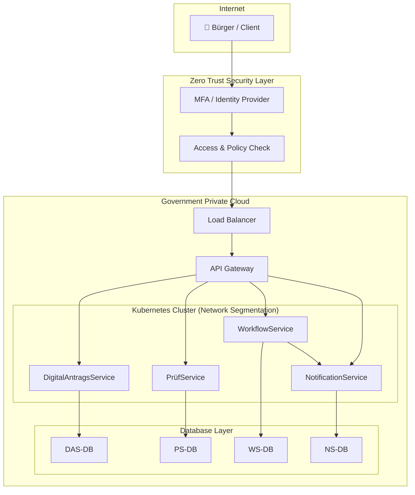

# Deployment Architecture

Dieses Dokument beschreibt die technische Bereitstellung der Plattform.

---

# Infrastrukturmodell

Die Plattform wird in einer hybriden Infrastruktur betrieben.

Komponenten:

- Government Private Cloud
- On-Premises Infrastruktur
- Containerplattform

---

# Infrastrukturkomponenten

## Containerplattform

Technologie:

- Docker
- Kubernetes

Verantwortlich für:

- Skalierung der Microservices
- Service-Orchestrierung
- Load Balancing

---

## API Gateway

Zentrale Schnittstelle für alle Anwendungen.

Funktionen:

- Routing
- Authentifizierung
- Rate Limiting
- Monitoring

---

## Identity System

Zentrale Authentifizierung.

Funktionen:

- Single Sign-On
- Multi-Faktor-Authentifizierung
- Rollenverwaltung

---

## Datenbanken

Mehrere spezialisierte Datenbanken:

Transaktionsdaten  
PostgreSQL

Dokumentenarchiv  
Dokumentenspeicher

Reporting  
Data Warehouse

---

# Deployment Diagram – Digitaler Antragsservice

Dieses Diagramm zeigt die Architektur eines digitalen Antragsservices innerhalb einer **Government Private Cloud** unter Berücksichtigung der Prinzipien:

* **Zero Trust**
* **Secure by Design**
* **Privacy by Design**

## Deployment Architektur

## Sicherheitsprinzipien

### Zero Trust

Folgende Mechanismen werden angewendet:

* **Jeder Zugriff wird authentifiziert und autorisiert**
* **MFA (Multi-Factor Authentication)**
* **API Gateway als zentraler Kontrollpunkt**
* **Netzwerksegmentierung im Kubernetes Cluster**

### Secure by Design

Sicherheitsmechanismen werden bereits während der Entwicklung integriert:

* **Security Scans im CI/CD-Pipeline**
* **Container Image Scanning**
* **Secure Configuration Management**
* **Infrastructure as Code**

### Privacy by Design

Datenschutz wird von Beginn an berücksichtigt:

* **Pseudonymisierung personenbezogener Daten**
* **Datenminimierung**
* **Service-basierte Datenhaltung**
* **Zugriffskontrollen auf Datenbanken**

---
