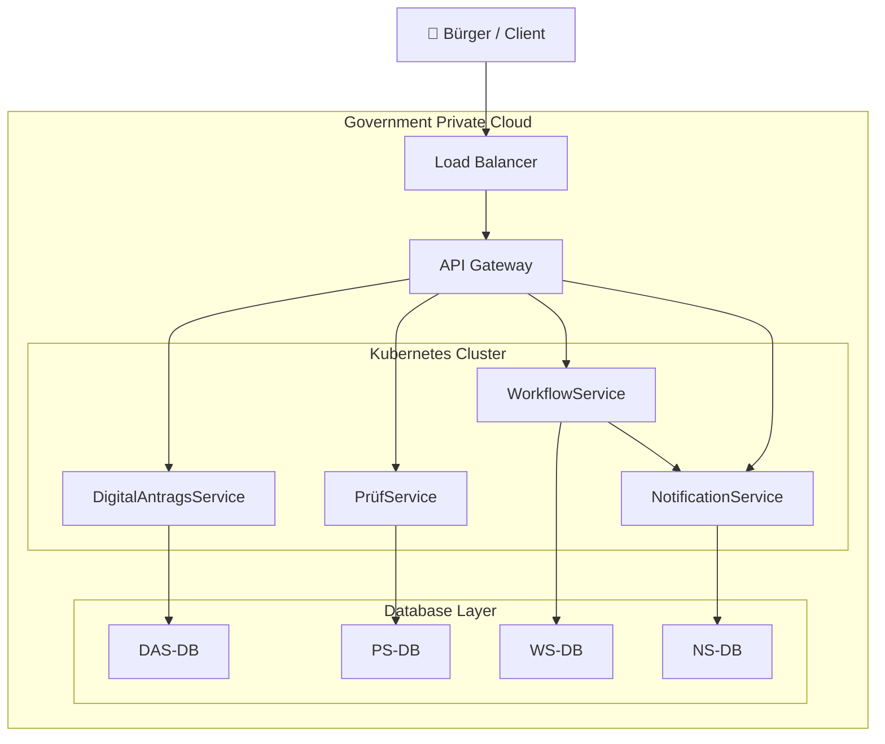

# Deployment Architecture

Dieses Dokument beschreibt die technische Bereitstellung der Plattform.

---

# Infrastrukturmodell

Die Plattform wird in einer hybriden Infrastruktur betrieben.

Komponenten:

- Government Private Cloud
- On-Premises Infrastruktur
- Containerplattform

---

# Infrastrukturkomponenten

## Containerplattform

Technologie:

- Docker
- Kubernetes

Verantwortlich für:

- Skalierung der Microservices
- Service-Orchestrierung
- Load Balancing

---

## API Gateway

Zentrale Schnittstelle für alle Anwendungen.

Funktionen:

- Routing
- Authentifizierung
- Rate Limiting
- Monitoring

---

## Identity System

Zentrale Authentifizierung.

Funktionen:

- Single Sign-On
- Multi-Faktor-Authentifizierung
- Rollenverwaltung

---

## Datenbanken

Mehrere spezialisierte Datenbanken:

Transaktionsdaten  
PostgreSQL

Dokumentenarchiv  
Dokumentenspeicher

Reporting  
Data Warehouse

---

# Deployment Diagram – Digitaler Antragsservice

Dieses Diagramm zeigt die Deployment-Architektur eines digitalen Antragsservices innerhalb einer **Government Private Cloud**.
Die Architektur nutzt **Kubernetes** für Microservices und einen **API Gateway Layer** zur Steuerung der Anfragen.

## Architekturübersicht

## Komponenten

### Benutzer

* **Bürger / Client** greifen über das Internet auf den Service zu.

### Infrastruktur

* **Load Balancer** verteilt eingehende Anfragen auf das API Gateway.
* **API Gateway** fungiert als zentraler Einstiegspunkt für alle Services.

### Microservices (Kubernetes Cluster)

* **DigitalAntragsService** – Verwaltung und Einreichung von Anträgen
* **PrüfService** – Validierung und Prüfung der Anträge
* **WorkflowService** – Steuerung des Bearbeitungsprozesses
* **NotificationService** – Versand von Benachrichtigungen (z. B. E-Mail)

### Datenbank Layer

Jeder Microservice besitzt eine eigene Datenbank:

* DAS-DB
* PS-DB
* WS-DB
* NS-DB

Diese Architektur folgt dem **Microservice-Prinzip „Database per Service“**.

## Kommunikationsfluss

1. Bürger sendet Anfrage an den **Load Balancer**
2. Load Balancer leitet Anfrage an das **API Gateway**
3. API Gateway routet Anfrage zum passenden **Microservice**
4. Microservices greifen auf ihre **jeweilige Datenbank** zu
5. WorkflowService kann den **NotificationService** zur Benachrichtigung auslösen

---

# Sicherheitsaspekte

Zero Trust Prinzip:

- jeder Zugriff wird geprüft
- Netzwerksegmentierung
- MFA

Secure by Design:

- Sicherheitsprüfungen in CI/CD
- sichere Konfigurationen

Privacy by Design:

- Pseudonymisierung
- Datenminimierung
