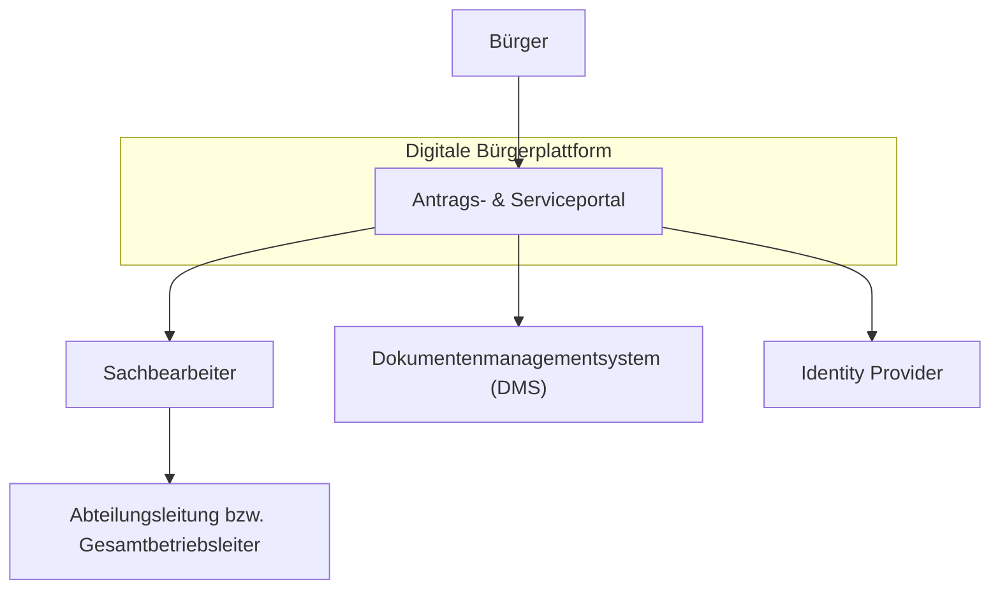

# System Context – Digitale Bürger-Services Plattform

Dieses Dokument beschreibt den Kontext der Plattform innerhalb der Behörde Musterstadt und deren Interaktion mit externen und internen Akteuren. Das Ziel des System Context Diagrams ist es, die wichtigsten Benutzer und externen Systeme darzustellen.

---

# Akteure

## Bürger

Bürger nutzen die Plattform, um:

- Anträge zu stellen
- Dokumente hochzuladen
- Status von Verfahren einzusehen
- Bescheide abzurufen

---

## Sachbearbeiter

Sachbearbeiter nutzen das System zur:

- Prüfung von Anträgen
- Bearbeitung von Vorgängen
- Kommunikation mit Bürgern
- Dokumentation von Entscheidungen

---

## Abteilungsleitung bzw. Gesamptbetriebsleiter

Die Leitung nutzt die Plattform für:

- Monitoring
- Reporting
- Prozessübersicht
- Entscheidungsunterstützung

---

## IT-Betrieb

Der IT-Betrieb ist verantwortlich für:

- Betrieb der Infrastruktur
- Monitoring
- Incident Management
- Sicherheitsüberwachung

---

# Externe Systeme

## Identity Provider

Authentifizierung der Benutzer.

Beispiele:

- Behörden-SSO
- Bürgerkonto

---

## Dokumentenarchiv

Langzeitarchivierung von Dokumenten.

---

## E-Mail / Benachrichtigungssystem

Versand von Statusmeldungen und Bescheiden.

---

# System Context Diagram

Dieses Diagramm zeigt den Systemkontext der **Digitalen Bürgerplattform** und die wichtigsten Akteure sowie angebundenen Systeme.

## Beschreibung

**Bürger**

* Reichen Anträge über die Digitale Bürgerplattform ein.

**Digitale Bürgerplattform**

* Zentrales System zur Bearbeitung digitaler Verwaltungsleistungen.

**Sachbearbeiter**

* Prüfen und bearbeiten eingereichte Anträge.

**Abteilungsleitung/Gesamtbetriebsleiter**

* Trifft Entscheidungen bei komplexen oder genehmigungspflichtigen Fällen.

**DMS**

* Speichert Dokumente und Antragsunterlagen.

**Identity Provider**

* Zuständig für Authentifizierung und Identitätsmanagement (z. B. SSO, MFA).

---

# Ziele

Der Systemkontext zeigt:

- wer das System nutzt
- welche externen Systeme integriert sind
- welche Organisationseinheiten beteiligt sind
